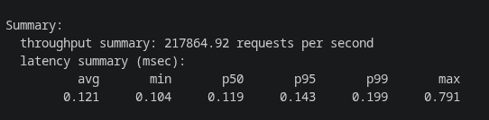
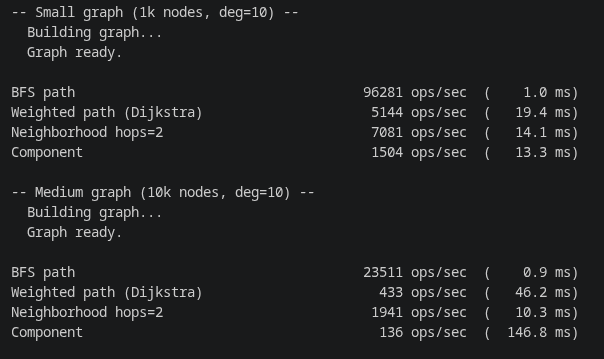

# FastGraph 🚀

A high-performance, in-memory graph database and key-value store built in C++17. FastGraph speaks the Redis RESP protocol, meaning it is **fully compatible with existing Redis clients**.

It combines the blinding speed of a C++ epoll-based TCP server with advanced graph traversals (BFS, DFS, Dijkstra), Custom Memory Allocators (Slab, Pool, Arena), a Robin Hood hash table for KV, and a custom SkipList for Sorted Sets.

## Features & Architecture
- **Redis Protocol (RESP)**: Drop-in replacement for any Redis client or `redis-cli`.
- **Memory Efficiency**: Custom memory allocators (Pool Allocator for connections, Slab Allocator for skip lists, Arena for graph traversals).
- **Graph Engine**: Supports Dynamic Graphs and CSR (Compressed Sparse Row) representation for high-speed paths (BFS/DFS/Dijkstra), components, and neighborhoods.
- **Sorted Sets**: Implemented from scratch using a fast Skip List.
- **Networking**: Custom non-blocking `epoll` reactor event loop.
- **Persistence**: RDB-style background saving (`BGSAVE`) via `fork` + `mmap`.

## Build & Run Guide

### Requirements
* Linux (`epoll` dependency)
* GCC or Clang with C++17 support
* CMake 3.16+

### Compiling
```bash
git clone https://github.com/Tanuj2005/FastGraph.git
cd FastGraph
cmake -B build -DCMAKE_BUILD_TYPE=Release
make -C build -j4
```

### Running
Start the server:
```bash
./build/fastgraph --config config.conf
```
*(Or simply `./build/fastgraph` to run with default 6379 port).*

Connect using any Redis client:
```bash
redis-cli -p 6379 PING
```

## Benchmarks 📊

### 1. Typical KV and Sorted Set Throughput (TCP)
FastGraph handles standard Redis KV and Sorted Set operations exceptionally well. You can benchmark it using `redis-benchmark`:
```bash
# Test Core KV Operations
redis-benchmark -p 6379 -n 100000 -c 50 -t set,get,del

# Test Sorted Sets Operations
redis-benchmark -p 6379 -n 100000 -c 50 -t zadd
```



### 2. Graph Traversal Throughput (TCP)
We provide a Python benchmark suite to test BFS, Dijkstra (WPATH), and Neighborhood sweeps over TCP:
```bash
# Run the graph benchmark suite (requires 'redis' python package)
python3 bench/bench_fastgraph.py
```


## Supported Commands
<details>
<summary>Click to expand all supported commands</summary>

### KV
`SET key value [EX seconds | PX milliseconds]`
`GET key`
`DEL key`
`EXISTS key`
`EXPIRE key seconds`
`PEXPIRE key milliseconds`
`TTL key`
`PTTL key`
`PERSIST key`
`DBSIZE`

### Graph
`GRAPH.ADD_NODE id label properties`
`GRAPH.ADD_EDGE src dst rel_type`
`GRAPH.DEL_NODE id`
`GRAPH.DEL_EDGE src dst rel_type`
`GRAPH.NODE id`
`GRAPH.HAS_NODE id`
`GRAPH.HAS_EDGE src dst`
`GRAPH.NEIGHBORS src`
`GRAPH.REVNEIGHBORS dst`
`GRAPH.PATH src dst`
`GRAPH.WPATH src dst`
`GRAPH.NEIGHBORHOOD src hops`
`GRAPH.COMPONENT src`
`GRAPH.HAS_CYCLE`
`GRAPH.DISTANCES src`
`GRAPH.INFO`

### Sorted Sets
`ZADD key score member`
`ZREM key member`
`ZSCORE key member`
`ZRANGE key start stop [WITHSCORES]`
`ZRANGEBYSCORE key min max`
`ZCARD key`
`ZRANK key member`

### System & Persistence
`PING [message]`
`SAVE`
`BGSAVE`
`BGRESTORE`

</details>

## License
Distributed under the MIT License.